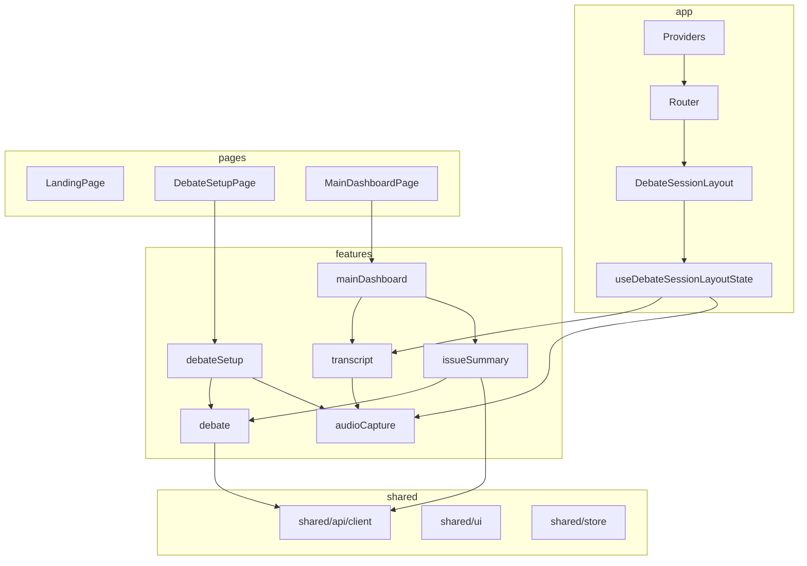
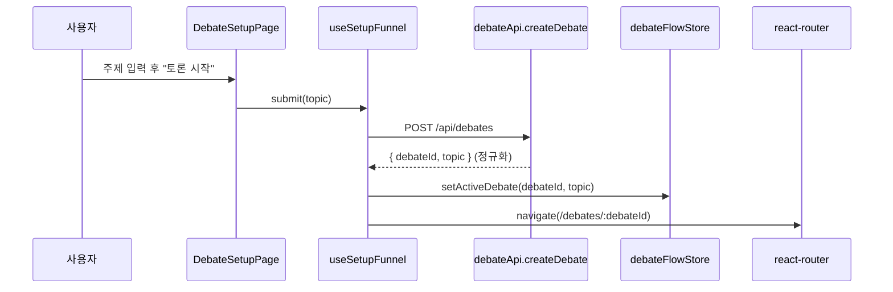
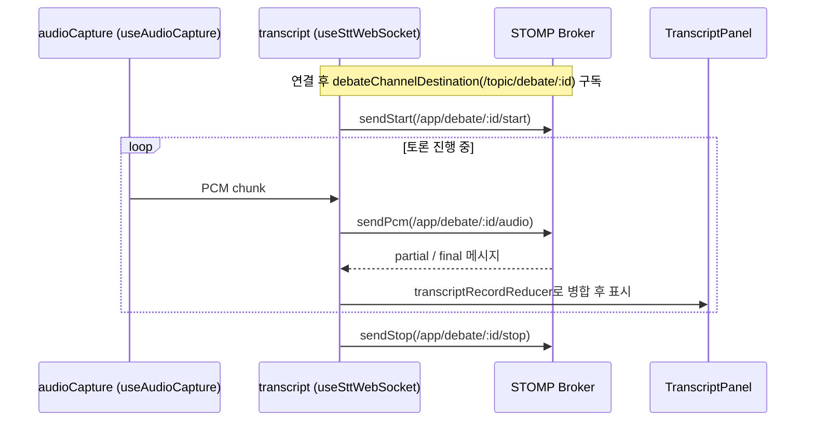
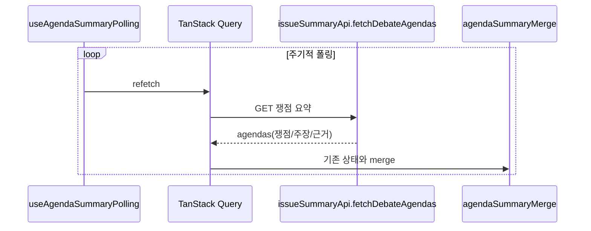

# ARCHITECTURE

프론트엔드의 레이어 구조와 데이터 흐름을 한눈에 파악하기 위한 문서다. "무엇이 어디 있고, 데이터가 어떻게 흐르는지"를 빠르게 잡도록 돕는다.

## 레이어 책임

| 레이어     | 책임                                                                       | 예                                                           |
| ---------- | -------------------------------------------------------------------------- | ------------------------------------------------------------ |
| `app`      | 부트스트랩, providers, router, 세션 레이아웃, cross-feature 오케스트레이션 | `providers.tsx`, `router.tsx`, `useDebateSessionLayoutState` |
| `pages`    | 라우트별 화면 조합(얇게)                                                   | `LandingPage`, `DebateSetupPage`, `MainDashboardPage`        |
| `features` | 도메인 기능 슬라이스(로직 집중)                                            | `transcript`, `issueSummary`, `audioCapture`                 |
| `shared`   | 도메인 무관 공통 자산                                                      | `shared/ui`, `shared/api`, `shared/store`                    |

## 모듈 의존 방향

화살표는 "의존(import)" 방향이다. feature는 `shared`와 핵심 도메인(`debate`)·capability(`audioCapture`)에만 의존한다. 여러 feature 조합은 컨테이너(`pages`/`mainDashboard`)에서 한다.

## 핵심 시퀀스: 토론 시작 → 세션 진입

## 핵심 시퀀스: 실시간 속기록(STT)

오디오 캡처와 STT는 세션 레이아웃에서 묶여 동작한다. 오디오 PCM을 STOMP로 보내고, 서버가 변환한 발화를 같은 채널에서 수신한다.

- `partial`은 생성 중 발화로 표시하고, `final` 수신 시 확정 목록으로 전환한다. 중복/지연 이벤트는 reducer에서 정리한다.
- 연결 상태(연결 전/중/실패/재연결/수신)는 별도 UI로 표시한다(Suspense 미사용).
- `topic`(주제)과 STOMP `/topic/...`(브로커 destination)은 다르다. 코드 식별자는 STOMP 쪽을 `channel`/`destination`으로 명명한다(CODE_CONVENTION §14).

## 핵심 시퀀스: 쟁점 요약 (폴링)

- 서버 상태(쟁점 요약)는 TanStack Query로 관리하는 유일한 영역이다. 나머지 서버 호출은 명령형(API 함수 직접 호출)이다.

## 상태 관리 요약

| 종류                | 도구                        | 위치                                                   |
| ------------------- | --------------------------- | ------------------------------------------------------ |
| 서버 상태(조회)     | TanStack Query              | `issueSummary/hooks/useAgendaSummaryPolling`           |
| 전역 UI/세션 플래그 | Zustand                     | `shared/store/uiStore`, `debate/store/debateFlowStore` |
| 실시간 스트림       | feature hook + `useReducer` | `transcript`, `issueSummary` merge                     |
| 트리 간 공유        | Context                     | `app/layouts/DebateSessionLayoutContext`               |
| 로컬                | `useState`                  | setup funnel, 모달 등                                  |

## 알려진 복잡도 (손댈 때 주의)

큰 리팩토링은 지금 당장 필요하지 않다. 아래는 "왜 지금은 괜찮은지 / 손댈 때 주의점"만 기록한다.

| 항목                                             | 현황                                                     | 손댈 때                                                                                                                                     |
| ------------------------------------------------ | -------------------------------------------------------- | ------------------------------------------------------------------------------------------------------------------------------------------- |
| `transcript/hooks/useSttWebSocket.ts` (~578줄)   | 연결/재연결/PCM 버퍼/partial·final 병합을 한 hook이 처리 | 동작은 정상. 분리한다면 연결 lifecycle / 메시지 병합 / PCM 전송을 별개 관심사로 나누고, 각 effect의 cleanup 대칭을 유지(CODE_CONVENTION §5) |
| `audioCapture/hooks/useAudioCapture.ts` (~345줄) | AudioWorklet + 다운샘플 + 청크                           | Web Audio 리소스(노드/스트림)의 cleanup이 setup과 대칭인지 확인                                                                             |
| `issueSummary → debate/api/paths` 의존           | `debate`를 핵심 도메인으로 보면 허용 범위                | 더 분리하려면 공용 경로를 `shared`로 올린다                                                                                                 |
| TanStack Query 사용 범위                         | 쟁점 요약 폴링 1곳만                                     | 다른 서버 호출(mutation)도 표준화하려면 Query 도입을 점진 확대                                                                              |
| 테스트 공백                                      | 순수 lib 단위 테스트 위주, hook/컴포넌트/e2e 없음        | 핵심 경로(STT 병합, 세션 흐름)부터 테스트 추가 권장                                                                                         |

## 관련 문서

- [코드 컨벤션](frontend/CODE_CONVENTION.md)
- [요구사항](product/REQUIREMENTS.md)
- [클라이언트 음성 입력/전처리](product/CLIENT_AUDIO_CAPTURE.md)
- [에이전트 작업 방식](AGENT_WORKFLOW.md)
