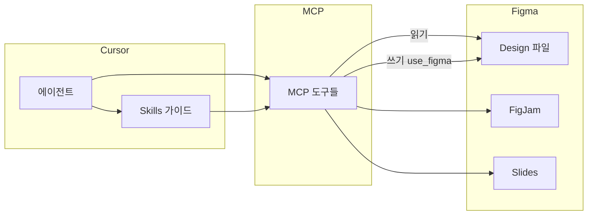

# Figma MCP 매뉴얼

Cursor의 **Figma 플러그인**은 에이전트와 Figma를 연결하는 **MCP 서버**와, 올바른 사용 순서를 안내하는 **Skills**로 구성됩니다. 코드와 디자인을 **양방향**으로 맞출 수 있습니다.

## 전체 구조

- **읽기**: Figma → 코드 구현용 컨텍스트
- **쓰기**: 코드/설명 → Figma에 화면·컴포넌트·토큰 생성·수정
- **Skills**: `use_figma` 같은 도구를 **호출 전에** 반드시 읽어야 하는 규칙·워크플로

## Skills (슬래시 명령)

채팅에서 `/`로 직접 호출하거나, 작업 유형에 맞으면 에이전트가 자동으로 로드합니다.

| Skill | 용도 |
|--------|------|
| `/figma-use` | **`use_figma` 호출 전 필수** — Plugin API 작성 규칙 |
| `/figma-generate-design` | 앱 페이지·모달 등을 Figma 화면으로 조립 |
| `/figma-generate-library` | 코드베이스에서 디자인 시스템·컴포넌트·토큰 구축 |
| `/figma-code-connect` | Figma 컴포넌트 ↔ 코드 매핑 (`.figma.ts` 등) |
| `/figma-generate-diagram` | **`generate_diagram` 호출 전 필수** — FigJam 다이어그램 |
| `/figma-create-new-file` | **`create_new_file` 호출 전 필수** — 새 파일 생성 |
| `/figma-use-figjam` | FigJam 전용 `use_figma` |
| `/figma-use-slides` | Slides 전용 `use_figma` |

**원칙**: 도구만 바로 호출하지 말고, 해당 Skill을 먼저 로드하면 실패·버그를 크게 줄일 수 있습니다.

## MCP 도구 (기능별)

### Figma → 코드 (디자인 구현)

| 도구 | 설명 |
|------|------|
| `get_design_context` | 노드의 참고 코드, 스크린샷, 힌트 반환. **가장 중요한 읽기 도구** |
| `get_screenshot` | 노드 스크린샷 |
| `get_metadata` | 노드 메타데이터 |
| `get_variable_defs` | 변수 정의 |
| `get_figjam` | FigJam 보드용 컨텍스트 |

### 코드 → Figma (디자인 생성·동기화)

| 도구 | 설명 |
|------|------|
| `use_figma` | Figma Plugin API로 JavaScript 실행. **일반적인 쓰기 작업의 기본** |
| `generate_figma_design` | 웹 페이지를 **처음** Figma로 캡처할 때 예외적으로 병행 |
| `create_new_file` | 새 Design / FigJam / Slides 파일 |
| `search_design_system` | 기존 DS 컴포넌트·토큰 검색 (**쓰기 전에 우선 호출**) |
| `get_libraries` | 라이브러리 목록 |
| `upload_assets` | 에셋 업로드 |

### Code Connect

| 도구 | 설명 |
|------|------|
| `get_code_connect_map` | 매핑 조회 |
| `add_code_connect_map` | 매핑 추가 |
| `get_code_connect_suggestions` | 매핑 제안 |
| `get_context_for_code_connect` | Code Connect 컨텍스트 |
| `send_code_connect_mappings` | 매핑 전송 |

### 다이어그램·기타

| 도구 | 설명 |
|------|------|
| `generate_diagram` | Mermaid 등으로 FigJam 다이어그램 생성 |
| `whoami` | 연결된 Figma 계정 확인 |

## `use_figma` 핵심

에이전트가 **짧은 JavaScript**를 Figma 파일 안에서 실행합니다. 일반 Figma 플러그인과 같은 `figma` 전역 API를 사용합니다.

### 필수 규칙 (요약)

1. **`return`으로 결과 전달** — `console.log`는 응답에 포함되지 않음
2. **작은 단계로 분할** — 한 번에 큰 작업하지 않기
3. **생성·수정한 노드 ID를 `return`** — 후속 호출에서 참조
4. 페이지 전환: `await figma.setCurrentPageAsync(page)` (`figma.currentPage =` 는 지원 안 함)
5. 텍스트 수정: **폰트 로드 → `await` → 수정**
6. 색상은 **0–1** 범위 (`{ r: 1, g: 0, b: 0 }` = 빨강)
7. `figma.notify()` 사용 불가
8. `getPluginData` / `setPluginData` 대신 `getSharedPluginData` / `setSharedPluginData` 사용

### 호출 시 파라미터

- `fileKey`: Figma 파일 키 (URL에서 추출)
- `code`: 실행할 JavaScript
- `description`: 작업 설명
- `skillNames`: `"figma-use"` 등 (Skill 로드 시 지정)

## URL 파싱

Figma URL에서 `fileKey`, `nodeId`를 추출합니다.

| URL 형식 | 용도 |
|----------|------|
| `figma.com/design/:fileKey/...?node-id=1-2` | Design. `node-id`의 `-` → `:` (`1:2`) |
| `.../branch/:branchKey/...` | `branchKey`를 `fileKey`로 사용 |
| `figma.com/make/:makeFileKey/...` | Figma Make |
| `figma.com/board/:fileKey/...` | FigJam → `get_figjam` |
| `figma.com/slides/:fileKey/...` | Slides |

## 워크플로

### 1) Figma URL → 코드

1. URL에서 `fileKey`, `nodeId` 추출
2. `get_design_context` 호출
3. 반환된 React+Tailwind 등은 **참고용** — 프로젝트 스택·컴포넌트·토큰에 맞게 재작성
4. Code Connect 매핑이 있으면 해당 코드 컴포넌트 우선 사용

**힌트 우선순위**

1. Code Connect 스니펫
2. 컴포넌트 문서 링크
3. 디자이너 주석
4. CSS 변수 형태의 디자인 토큰
5. raw hex / absolute positioning (스크린샷과 함께 해석)

### 2) 코드/페이지 → Figma

1. `/figma-generate-design` (+ 필요 시 `/figma-use`) 로드
2. **`search_design_system` 먼저** — DS 컴포넌트 재사용
3. 웹 앱 **첫 캡처**: `generate_figma_design` + `use_figma` 병행 가능
4. 이후 수정·동기화: **`use_figma`만**

### 3) 디자인 시스템 구축

`/figma-generate-library` + `/figma-use` — 변수 → 컴포넌트 → variant → 테마 순서

### 4) FigJam 다이어그램

`/figma-generate-diagram` → `generate_diagram`

### 5) 새 파일에서 시작

`/figma-create-new-file` → `create_new_file` → `use_figma`

## `use_figma` vs `generate_figma_design`

| 상황 | 사용 도구 |
|------|-----------|
| 대부분의 Figma 쓰기 | `use_figma` |
| 웹 앱 페이지를 **처음** Figma로 가져올 때 | `generate_figma_design` + `use_figma` 병행 |
| iOS/Android/일반 UI, 처음부터 디자인 | `use_figma`만 |
| 이미 캡처된 Figma 페이지 업데이트 | `use_figma`만 |

## 인증

Figma MCP 서버(`plugin-figma-figma`)는 **최초 사용 시 인증**이 필요합니다. Cursor가 `mcp_auth`를 요청하면 승인합니다. 만료 시 다시 로그인할 수 있습니다.

`whoami`로 연결 계정을 확인할 수 있습니다.

## 채팅 사용 예시

- `이 Figma 링크대로 로그인 화면 구현해 줘` → design-to-code
- `홈 화면을 Figma에 만들어 줘` → generate-design + use_figma
- `Button 컴포넌트 Code Connect 연결해 줘` → figma-code-connect
- `/figma-create-new-file figjam 아키텍처 보드` → 새 FigJam 파일

## 참고

- MCP 서버 식별자: `plugin-figma-figma`
- 상세 Plugin API 규칙: Cursor에서 `/figma-use` Skill 및 `references/` 문서
- 공식 MCP 안내: Figma 플러그인 `INSTRUCTIONS.md` (design-to-code / code-to-design 워크플로)
